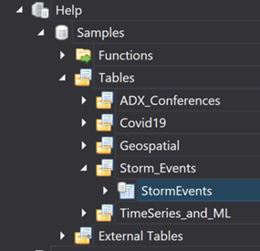
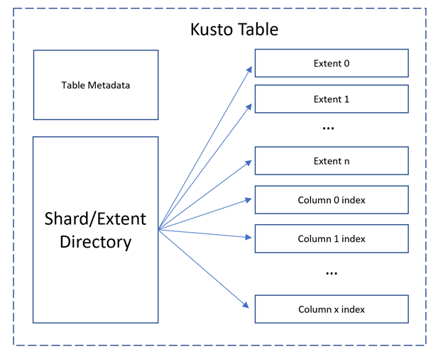
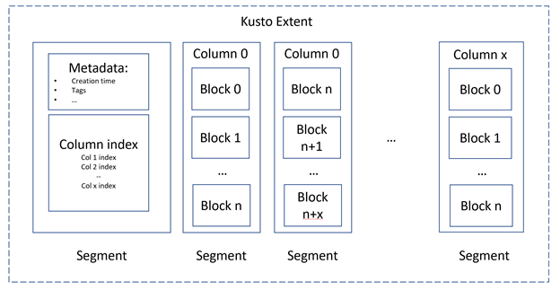
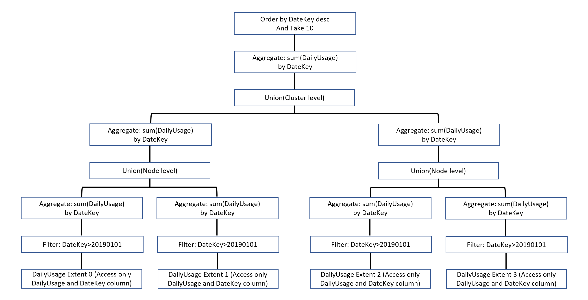
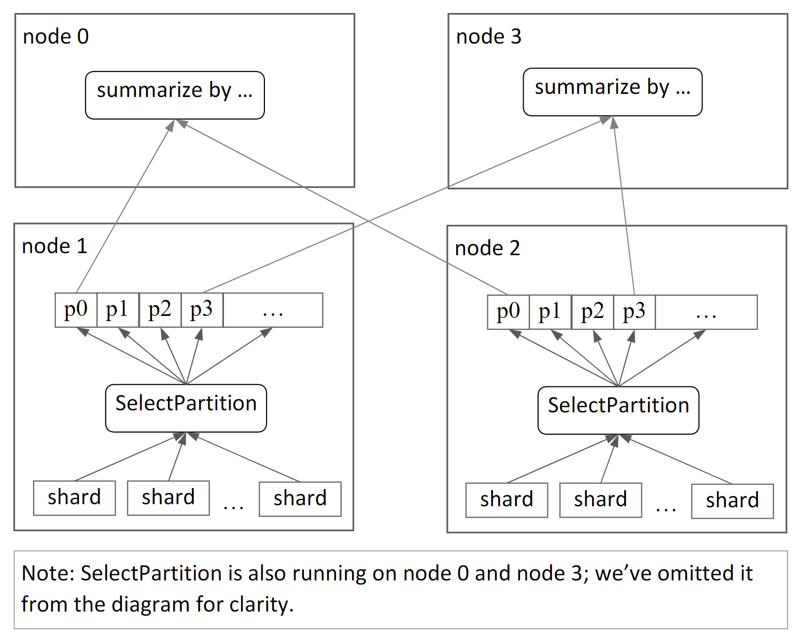

# Understand Kusto Inside Out and Why Kusto Is So Fast

Kusto is a good name, but now it is only a nickname, Kusto’s official name is Azure Data Explorer or ADE. 

Query data in Kusto is fast, way faster than the transitional RDBMS, such as SQL Server, MySQL etc. Especially when the data size growing to billions of rows and continually growing in billion size. 

## Purpose
We have been using Kusto as the data analysis query engine for more than two year. In the passing months, we are also building a Azure feature fully on Kusto instead of SQL Server. 

By this article, I am trying to explain why Kusto is so fast from both data storage and query execution perspectives. This article may not helps you writing a better Kusto query immediately, but may help you troubleshoot scripts that report errors and make a sense decision when build an application on Kusto. 

Before reading through it, assume you are somewhat familiar with Kusto query and have a test cluster in your reach. if you don’t have one, it is easy to create a test cluster by following this [instruction](https://docs.microsoft.com/en-us/azure/data-explorer/create-cluster-database-portal). 

Be aware that the description and graphics do not cover the exact detail of data flow and structure.

## Why Kusto is Fast in Nutshell
Compare with SQL Server, Kusto’s high speed query is not source from magic, the speed is a tradeoff of data processing, want some features and also give up some. 
* Kusto store data in a distributed structure, in the end, the data bytes are located in several disks (ssd or traditional spinning hard drive), which means the data can be processed parallelly. 
* By default, Kusto store the in columnar form, so that the engine need only access to the columns that involved in the query instead of scanning all data compare with row store data. 
* Kusto cluster is node cluster, the word “node” here is actually a Azure Virtual Machine, which means the query can be processed parallelly.
* Kusto is designed for data that are read-only, delete-rarely, and no updates at all.
* Kusto is designed for ingesting data fast, it does not apply the data constraints checks, say, uniqueness check like a traditional SQL Database has. 

## Kusto Cluster Architecture
If you have your Kusto Explorer installed, a Kusto cluster looks like this:  


In the screenshot, “Help” is the cluster name, “Samples” is the database name. But what is the “cluster” means in the overall Kusto design, why not call it Kusto server? The “cluster” comes with a reason. 

Kusto cluster is a collection of compute nodes (Azure Virtual Machine). Those nodes connect to a V-Net and forms a computing cluster. The cluster can be shrunken or expand (scale up/down, or increase/decrease VM #) at will. The minimum cluster size is two nodes, aka, two VMs. the maximum is about 500. 

Each node can be one or more of the following roles. **1) Admin Node**: responsible for maintaining the overall cluster metadata. **2) Query Head**: responsible for accepting and processing Kusto query, when you see, Kusto engine or Kusto query planer, usually refer to query head node. **3) Data Node**: the most common role, like its name indicates, this node responsible for: first. storing data; second. contribute the CPU and memory when execute the Kusto query. **4) Gateway Node**: responsible for processing external API calls, authentication, and request dispatches. 

Every cluster has one Admin node, one of the most important job of Admin role is maintaining a cluster metadata snapshot. The Admin node will load the metadata snapshot from Azure blob storage to its memory and maintains it as immutable data structure. 

If the current Admin node becomes unavailable, new Admin is immediately elected(no court involved :D), then load the metadata snapshot, and also send a survey to the rest nodes to collect their runtime status. 

## Kusto Cluster Logical Structure

From the logical view, A cluster contains one or several databases, like SQL Server, a database contains tables. and each table is a union of data extent(or data shard, I will use extent in following article), each extent is a combination of columnar data blocks. and Policy objects, which can be apply to each layer, even in the column level.

```
Cluster
|___database 1
|   |___table 1
|   |   |___extent data
|   |   |   |___column 0
|   |   |   |   |___data blocks
|   |   |   |   |___policy:authorization;data retention...
|   |   |   |___column 1
|   |   |___schema,ordered list of fields
|   |   |___policy objects:authorization;data retention...
|   |___table 2
|   |___policy objects:authorization;data retention...
|___database 2

```
Unlike SQL Server, the data extent is evenly distributed to different nodes instead of storing all data in one data block.

Let’s drill down to the table level. Each kusto table has four components. 

**Table Metadata** include information such as table name, its folder name, how many extents it has. etc. you can execute the .show table command to see part of the metadata.
```kusto
.show table TableName detail
```

**Extent directory** is an index of table extents and index reference, order by ingest time, that is why the first [best practice](https://docs.microsoft.com/en-us/azure/data-explorer/kusto/query/best-practices) of kusto query is using “Time Filters”. By using the time filter, the Kusto query engine can reduce the data extent number dramatically. 
If you are using other filter like an Int type data column, the Kusto engine will still need to scan all table extents. 

**Extent** is the data block that hold the real columnar data, stored as Azure blob. so that data in the Data Node can be access by Azure blob URL:
```
http://mystorageaccount.blob.core.windows.net
```
Will discuss more on the data extent in next section. 

**Column Index** as its name suggested, it is a index for columns, in SQL Server, we need manually and carefully create indexes for the needed column for the best performance. 
In Kusto, by default, every field is indexed during the data ingestion stage. one index for one column. In the table level index, the index keys point to extent address. 

## Data Extent (aka Data Shard)
Kusto data extent is kind like a mini Kusto table, each extent has its own metadata, column index, and columnar data subdivided into segments. 



By arranging data in the columnar form, one Kusto query will need only parse the required columns in the project section only, instead of accessing all data.

## Kusto Index

Inside of the extent, the leaf of column index point to data blocks, unlike the table level index, its leaf point to extent location. 

**String column index**: inverted term index as a B-tree. This kind of of index grant Kusto a powerful capability of text processing(Similar to ElasticSearch). the "contains" operator is way faster than "like" in T-SQL. 
**Numeric column (include DateTime and TimeSpan) index**: range-based forward index.  
**Dynamic column index**: inverted term index as a B-tree, during data ingestion, the engine will enumerates all elements within the dynamic value and forward then to the index builder. 

## A Journey of data ingestion
Imaging you have a CSV log file in hand and want to load it to Kusto. Here is what will happen when you execute the ingest command. 

**Step 1.** The ingest command arrives at the Admin node. the node see, ah ha, this is a Log data, and find the right table schema. 

**Step 2.** Admin node scans all nodes and find an available Data node to perform the processing and forwards the ingestion command to the target node(be aware that the Admin node can also be Data node, in that case, the ingestion command is forward to itself)

**Step 3.** Data node will create data extent, after ingestion finishing , the new extents information will be send back to the Admin node. 

**Step 4.** Admin node will finish two tasks. 1) Add the new shard reference to the table metadata. 2) commits the new snapshot of the database metadata. Now, the new extent or several extent are sealed and become immutable. 

## Data deletion

When a data shard is deleted, it is not really delete from the blob storage, the deletion happens on the reference tree at first, and the reference to the going deleted extent will be garbage collected in the container level. the shard will be hard deleted until the container reach to its threshold.

You may ask, what if I am querying the going delete data just before the data deletion command is executed?

Since shard deletion is not really delete the shard data, when you start querying before the deletion, you are using the old metadata snapshot which contains the reference to the going deleting extent. So, your query can still be executed and return result.

You may also ask, like you said, the deletion is actually an update of reference tree, can I recover the deleted data by reverting metadata to a previous version?

Yes, you can do it,if the "data" in the Azure blob is still there. 

The only exception is "data purge" command, which is designed for GDPR compliance. Data purge command will delete the reference to the blob completely. There is no way to revert the purge data back. 

## Kusto Query Execution

Assume you have a daily usage table that include all usage information, this table has over 1 billion rows and grows in millions size each day. So that effective performance tune should have observable execution time impact.

Script A, Put *where* before the aggregation summarize
```kusto
UsageDailyb
| where DateKey > 20190101
| summarize 
    DailyUsage_sum = sum(DailyUsage)
    by DateKey
| order by DateKey desc
| take 10
```
Script B, Put *where* after the aggregation summarize  
```kusto
UsageDaily
| summarize 
    DailyUsage_sum = sum(DailyUsage)
    by DateKey
| where DateKey > 20190101
| order by DateKey desc
| take 10
```
Which script will return the result first, will script A use less time than script B? the result is: **Almost The Same**. How could it be?! Let's go deep and find out why. 

**Abstract Syntax Tree(AST) and Relational Operators Tree(RelOp Tree)**

Like SQL/T-SQL language, the Kusto language engine will first parse the coming script into an Abstract Syntax Tree(AST), and performs semantic pass over the AST. 
1. Check names, see if the reference table,functions,pre-defined variables are existed in the database and query context.
2. Verify the user has the permissions to access the relevant entity. 
3. Check data type and reference, e.g. is a int function dealing a string? 

After the semantic pass, the query engine will build an initial Relational Operators Tree(RelOp Tree) based on the AST. T-Sql in SQL Server undergoes similar processes. 

Next, Kusto engine will further *attempt* to optimize the query by applying one or multiple predefined rewriting rules. 
1. Query engine will replace the table access with extent union structure. 
2. Push down filters, if the filter predicates involves no extend command, all filters will be push down to the tree leaf. This is why Script A and Script B uses almost the same time. Because after query optimization, both A and B share the same RelOp Tree. 
3. Aggregations ops are split into the "leaf". 
4. Top n operators are replicated to each data extent. 

After optimization, both Script A and Script B will share a common RelOp tree like this: 


## Summarize and Join Strategies

In the above UsageDaily query sample, the final group number will be several hundreds based on the time you run the test code. from the diagram, we can see each extent apply the filter and aggregating,then data being union to node level and aggregated again. Each step process a relative small size of data. In the node level, several hundreds group means several hundreds rows of data, will be a piece of cake. 

But, what if the hash join or grouping number(cardinality) is in millions size, even billions size? the problem here will be,the data processing might exceed the node memory budget and lead to query failure.

Kusto solves this large data size problem by dividing the Large data into small batches and process data batches one by one. Aka, Trade time for space. 

Kusto engine has a set of data moving strategies to deal with each case. The Kusto engine estimate the size(number of rows) and the cardinality(number of groups) for aggregation and join operation, then decides on applying one of three implementation strategy. 

**Strategy 1: Pull all data to this node**  
Case: If both join sides are of similar and the key cardinality size is less than 1 million.   
Action: Kusto engine pull all sides data to the same node and perform a non-distributed hash join there. 

**Strategy 2: Broadcast the small side**  
Case: If one of the join sides has up to 100k records and is significantly smaller than the other side. 
Action: Kusto engine embed the smaller side as a table, then broadcast this table to each node and perform the hash join. So that avoid moving large side data around. 

**Strategy 3: Shuffle data**  
Case: If the processing data(one side of join, or total data aggregation) key cardinality exceed 1M, and both join sides key cardinality exceed 100k. In other words, there are huge data to process.  
Action: Kusto engine use the formula to partition the data set into a number of disjoint sets based on the hash of the join or summarize key. 
```
hash(K) mod N
```
Let me reuse the DailyUsage script for example, if the engine decide to partition data to 3 disjoint sets. a SelectPartition operator will be called and execute
```
hash(20200101) mod 3
```
then, store the partitioned hash table in a FIFO kind queue, and distribute the queue to all other nodes when needed. thus solve the "huge data memory overflow" problem. 


## Kusto Limitations 

Kusto is originally designed as an ad-hoc query engine, however, with huge advantage of fast querying and text data process capability, more and more teams(include mine) are start using Kusto as big data platform, sometimes aiming to replace traditional database like SQL Server. If you are doing so, please do note the limitations and walk around those to tune Kusto fit your needs. Here I list some common limitations and the potential solutions. 

**1) Limit on query concurrency**

You can estimate the max concurrent number by 
```
[Cores per node] x 10
```
For example, if your cluster runs on a collection of 8 cores VM nodes, by default, your cluster should be able to execute 80(8x10) queries concurrently. You can also view the actually number by run this Kusto command if you have the permission to run it. 

```kusto
.show cluster policy querythrottling 
```

**2) Limit on node memory**

Your Kusto administrator may set the maximum memory usage by setting option
```
max_memory_consumption_per_query_per_node
```
To override it. you can set the upper bound on the amount of memory that can be used on a single node for your specific query 
```kusto 
set max_memory_consumption_per_query_per_node=68719476736;
MyTable | ...
```

The setting will not have any further effects if the number is larger than the node's physical memory.

**3) Limit on memory per iterator**

Whenever there is a join or summarize, Kusto engine use a pull iterator to fulfill the request. This limitation is for protecting queries from using too much memory. 

By default, the limitation is set to 5 GB. and you can increase this value by up to the half of the physical memory of the node. 
```kusto 
set maxmemoryconsumptionperiterator=68719476736;
MyTable | ...
```

If your query hit this limitation, you may see a error message has "...exceeded memory budget...". 

Usually, you will hit this limitation when no timestamp applied, or not adding predicator in | where clause. The data size is so huge that data shuffling strategy can't mitigate the memory burden. 

**4) Limit on result set size**

You will hit this limitation when your query's result dataset rows number exceed 500,000  or the data size exceed 64 MB. if your script hit this limitation , you will see error message contains "partial query failure". 

To solve or avoid this limitation. you can 
* summarize the data to output only interesting result(if not, are you going to read the data row by row?).
* use a take operator to see a small sample of the result.
* use project operator to output the columns you need.

Because this limitation apply to sub queries when referencing to another cluster, or you insist that you want to output the data and copy to Excel. you can use this command to remove the limitation:
```kusto 
set truncationmaxsize=1048576;
set truncationmaxrecords=100000;
MyTable | where User=="UserId1"
```

**5) Limit on query complexity**

Usually, you won't hit this limitation unless your Kusto query is extremely complex. for example, you have 5,000 conditions in the where clause. 
```kusto
T 
| where Column == "value1" or 
        Column == "value2" or 
        .... or
        Column == "valueN"
```
As we discussed before, each query will be transformed to a RelOp tree, if the tree depth exceed the threshold, you hit the limitation. You can rewrite the script logic to solve it. 
```kusto
T 
| where Column in ("value1", "value2".... "valueN")
```

## Reference Documents 

* [Azure Data Explorer services for storing and running interactive analytics Big Data](https://techcommunity.microsoft.com/t5/educator-developer-blog/azure-data-explorer-services-for-storing-and-running-interactive/ba-p/739121)
* [Kusto White paper](https://azure.microsoft.com/mediahandler/files/resourcefiles/azure-data-explorer/Azure_Data_Explorer_white_paper.pdf)
* [Kusto 101](https://azure.microsoft.com/en-us/blog/azure-data-explorer-technology-101/)
* [Kusto Query Limitations](https://kusto.azurewebsites.net/docs/kusto/concepts/querylimits.html?q=kusto%20limitation)